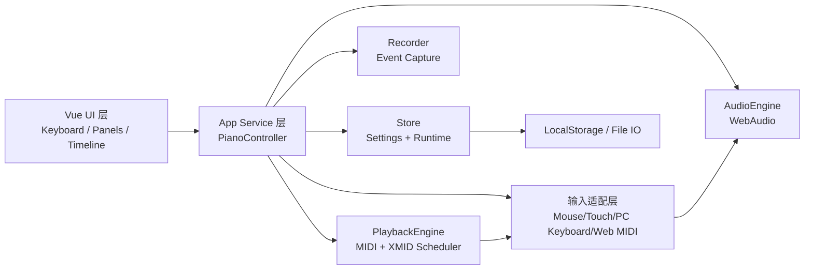

# 本地复现方案设计文档（xiwnn 在线钢琴）

## 1. 目标与范围

### 1.1 目标
- 在本地复现一个可运行的 H5 在线钢琴应用，核心体验对齐目标站点：
  - 88 键可视化钢琴
  - 鼠标/触屏/电脑键盘/外接 MIDI 输入
  - MIDI 文件播放
  - 演奏录制与回放
  - 设置持久化
- 构建为工程化项目（可开发、可测试、可发布）。
- 建立规范 git 流程并同步到云端仓库。

### 1.2 非目标（V1 不做）
- 用户账号体系与登录。
- 评论区服务端（仅保留前端占位或本地模拟）。
- 完整复制原站全部 UI 细节与全部页面模块（只做钢琴核心域）。

## 2. 需求清单

### 2.1 功能需求（V1）
1. 键盘区：
   - 88 键渲染（白键/黑键）
   - 键位按下高亮
   - 支持横向缩放与平移
2. 输入系统：
   - 鼠标点击与拖拽连奏
   - 触摸多点按压
   - 电脑键盘映射弹奏（支持升调与延音策略）
   - Web MIDI 输入（可选开启）
3. 发声系统：
   - 基于 WebAudio 进行发声
   - 支持样本/音色加载与播放
   - 支持音符释放包络（避免爆音）
4. MIDI 播放：
   - 导入 `.mid/.midi`
   - 播放/暂停/停止
   - 显示当前时间与总时长
5. 录制回放：
   - 记录 `noteOn/noteOff + 时间戳`
   - 回放录制事件
   - 导出/导入自定义 `.xmid` 文本格式
6. 设置系统：
   - 是否显示键名/编号/中央 C
   - 自动延音时长
   - 键盘映射方案切换与本地存储
7. 可视化：
   - 简化版音符下落（canvas）

### 2.2 非功能需求
- 首屏可交互时间 < 3s（本地开发环境）。
- 钢琴按键触发延迟低，主观可接受。
- 桌面端主流 Chrome/Edge 兼容；移动端触屏基础可用。
- 模块化结构，便于后续增加节拍器、曲谱等功能。

## 3. 技术选型

- 构建工具：Vite
- 语言：TypeScript
- UI 框架：Vue 3（Composition API）
- 状态管理：Pinia
- 音频：WebAudio API（封装 AudioEngine）
- MIDI 解析：`@tonejs/midi`（解析标准 MIDI 文件）
- 样式：CSS Modules 或全局 SCSS（二选一）
- 质量工具：ESLint + Prettier + Vitest（基础）

选型理由：
- 与目标站点的工程风格（Vite + Vue）对齐，迁移与扩展成本低。
- TypeScript 有利于事件模型、播放调度、录制格式的边界约束。

## 4. 架构设计

### 4.1 分层架构



### 4.2 关键模块
- `note-mapper`：
  - 键位编号（1-88）与音高（MIDI note number）互转
  - 黑白键布局计算与 hit-test
- `input-manager`：
  - 汇聚各输入源事件到统一协议：
    - `noteOn(note, velocity, source)`
    - `noteOff(note, source)`
  - 维护按键状态与延音状态
- `audio-engine`：
  - 初始化 AudioContext
  - 加载音色/采样
  - 提供 `playNote` / `stopNote` / `stopAll`
- `midi-player`：
  - 解析 MIDI -> 事件队列
  - 调度播放/暂停/停止
  - 输出播放进度事件
- `recorder`：
  - 录制统一输入事件
  - 输出 `.xmid`（文本）并支持解析回放
- `settings-store`：
  - 显示项、映射、延音参数、缩放平移
  - 本地持久化与版本化迁移

## 5. 数据与文件格式

### 5.1 设置存储（localStorage）
- key: `piano_v1_settings`
- 示例结构：
```json
{
  "showKeyName": true,
  "showKeyNumber": false,
  "autoSustainMs": 500,
  "shiftSharp": true,
  "tabSustain": true,
  "keyboardScale": 1,
  "keyboardOffset": 0,
  "pcKeyMap": {
    "81": 40,
    "87": 42
  }
}
```

### 5.2 xmid（自定义录制格式）
- 文本头：
  - `!xmid`
  - `v:1`
- 主体：
  - `time,eventType,note,velocity`（`eventType`：`1 noteOn` / `2 noteOff`）
- 优点：
  - 可读、可调试、便于版本升级。

## 6. 页面与交互结构

- 主页面区域：
  - 顶部控制条：播放/暂停/停止、导入、录制
  - 中央可视化：音符下落 canvas（可开关）
  - 底部钢琴键盘：88 键
- 侧边设置面板：
  - 视觉选项
  - 键盘映射管理（默认方案 + 自定义）
  - MIDI 外设连接状态

## 7. 实施计划（里程碑）

### M1 基础骨架（1 天）
- 初始化工程、目录结构、路由/状态管理
- 画出 88 键并支持鼠标点击发声（基础音色）

### M2 输入与设置（1 天）
- 接入电脑键盘映射 + 触摸
- 设置面板与 localStorage 持久化

### M3 MIDI 与录制（1-2 天）
- `.mid` 导入解析与播放控制
- 录制、`.xmid` 导出导入与回放

### M4 打磨与验证（1 天）
- 音符下落可视化
- 兼容性处理、异常与提示
- 文档补齐、脚本完善

## 8. 测试与验收

### 8.1 手工验收清单
- 按键响应：鼠标、触摸、电脑键盘、MIDI 设备
- MIDI 文件能正确播放/暂停/停止
- 录制后回放一致，导出再导入可重放
- 刷新页面后设置仍保留

### 8.2 自动化（V1 最小集）
- 单元测试：
  - note 映射转换
  - xmid encode/decode
  - MIDI 事件队列排序与调度逻辑
- CI（后续）：
  - `npm run lint`
  - `npm run test`
  - `npm run build`

## 9. 风险与应对

- 音色资源体积大导致加载慢：
  - 分段加载、显示加载进度、提供简化音色兜底
- 浏览器自动播放策略阻止音频：
  - 首次用户交互后初始化 AudioContext
- MIDI 设备兼容差异：
  - 将 Web MIDI 设为可选能力并提供清晰错误提示

## 10. Git 管理与云端同步方案

### 10.1 分支策略
- 主分支：`main`
- 功能分支：`codex/piano-repro-v1`

### 10.2 提交策略
- 使用 Conventional Commits：
  - `feat(piano): ...`
  - `feat(midi): ...`
  - `docs(architecture): ...`
  - `chore(ci): ...`
- 每个里程碑至少一个可回滚、可运行的提交。

### 10.3 同步策略
1. 本地开发在功能分支进行。
2. 每完成里程碑执行：
   - `git status --short --branch`
   - `npm run build`（及必要测试）
   - `git add -p` 精确暂存
   - `git commit`
   - `git push -u origin codex/piano-repro-v1`（首次）/ `git push`
3. 准备合并时发起 PR 到 `main`。

## 11. 交付物

- 源码工程（本地可运行）
- 本设计文档
- README（运行、构建、功能说明）
- 提交历史与远端分支

